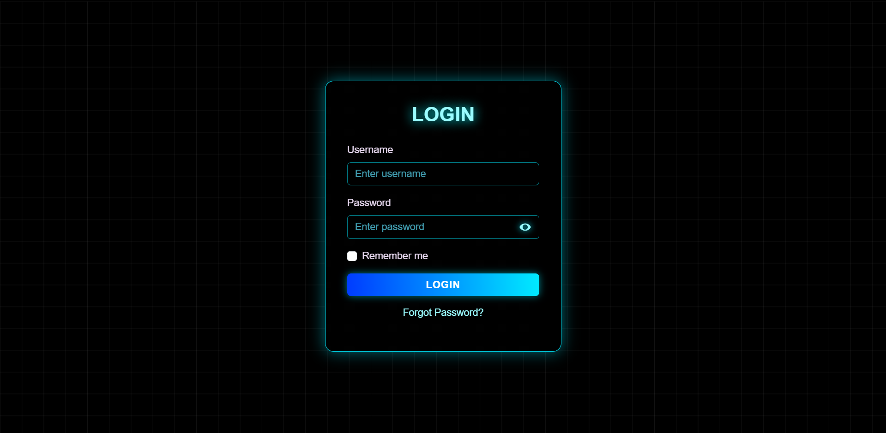
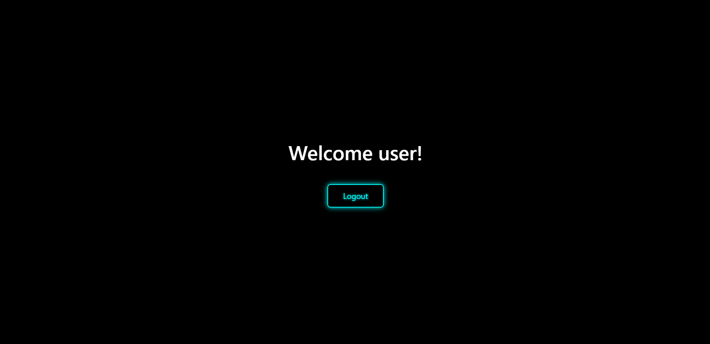

<div align=center>
<a name="top"></a>
  
# Authentication System

A modern, neon-themed Django application featuring a secure and responsive user authentication system with login and logout functionality.

[](https://www.python.org/)
[](https://www.djangoproject.com/)
[](https://getbootstrap.com/)
[](https://www.sqlite.org/)
[](LICENSE)

## screenshot
#### Login Page
A sleek login form with neon effects, password toggle, and error messaging.


#### Welcome Page
Simple welcome message displaying the logged-in username with logout option.


</div>

>**⚠️Note:** This project does **not include a user registration page**.  
> Users must be created manually using Django admin or by running `createsuperuser` before logging in.  
> Example command and input:
>
> ```bash
> python manage.py createsuperuser
> ```
>
> When prompted, enter sample values like:
>
> ```
> Username: testuser
> Email address: testuser@example.com
> Password: Test@1234
> Password (again): Test@1234
> ```
>
> After this, you can log in to the app with:
>
> ```
> Username: testuser
> Password: Test@1234
> ```
>
> ⚠️ Note: This password is for **testing/demo purposes only**. Do not use it in production.

## Features

- **User Authentication**: Secure login and logout using Django's built-in authentication system
- **Neon UI Design**: Modern, cyberpunk-inspired interface with glowing neon effects
- **Responsive Design**: Built with Bootstrap 5 for mobile-friendly experience
- **Password Visibility Toggle**: Eye icon to show/hide password input
- **Error Handling**: Displays invalid credentials message on failed login attempts
- **Session Management**: Automatic redirection based on authentication status
- **Custom Styling**: Unique neon-themed CSS with animated grid background

## Technologies Used

- **Backend**: Django 5.2.8
- **Frontend**: HTML5, CSS3, Bootstrap 5
- **Database**: SQLite3
- **Styling**: Custom CSS with neon effects and animations

## Project Structure

```
Authentication_System/
├── 📄 manage.py                    # Django management script
├── 📄 db.sqlite3                   # SQLite database
│
├── 📁 authentication_system/       # Main Django project directory
│   ├── 📄 __init__.py
│   ├── 📄 asgi.py                  # ASGI configuration
│   ├── 📄 settings.py              # Project settings
│   ├── 📄 urls.py                  # Main URL routing
│   └── 📄 wsgi.py                  # WSGI configuration
│
├── 📁 authenticate/                # Django app for authentication
│   ├── 📄 __init__.py
│   ├── 📄 admin.py                 # Admin setup
│   ├── 📄 apps.py                  # App configuration
│   ├── 📄 models.py                # Uses Django's built-in User model
│   ├── 📄 tests.py
│   ├── 📄 urls.py                  # App URL configuration
│   ├── 📄 views.py                 # Login, logout, index views
│   └── 📁 migrations/              # Database migrations
│       └── 📄 __init__.py
│
├── 📁 templates/                   # HTML templates
│   ├── 📄 login.html               # Login page
│   └── 📄 index.html               # Dashboard / welcome page
│
├── 📁 static/                      # Static files directory
│   └── 📄 style.css                # Custom neon-themed CSS
│
├── 📁 assets/                      # Project images / assets
│   ├── 🖼️ index.png                # Screenshot of index (welcome) page
│   └── 🖼️ login.png                # Screenshot of login page

```

## Installation

1. **Clone the repository**:
   ```bash
   git clone https://github.com/Ar-jun-fs9/django-user-auth-system.git
   cd Authentication_System
   ```

2. **Create a virtual environment**(Optional):
   ```bash
   python -m venv venv
   source venv/bin/activate  # On Windows: venv\Scripts\activate
   ```

3. **Install dependencies**:
   ```bash
   pip install django
   ```

4. **Run migrations**:
   ```bash
   python manage.py migrate
   ```

5. **Create a superuser** (optional, for admin access):
   ```bash
   python manage.py createsuperuser
   ```

## Usage

1. **Start the development server**:
   ```bash
   python manage.py runserver
   ```

2. **Access the application**:
   - Open your browser and go to `http://127.0.0.1:8000/`
   - You'll be redirected to the login page if not authenticated

3. **Login**:
   - Use Django admin credentials or create users via admin panel
   - Default admin URL: `http://127.0.0.1:8000/admin/`

4. **Features**:
   - Enter username and password
   - Toggle password visibility with the eye icon
   - Check "Remember me" (currently cosmetic)
   - Click "LOGIN" to authenticate
   - After successful login, you'll see a welcome message
   - Click "Logout" to end the session

## Configuration

### Static Files

- Static files are served from the `static/` directory
- CSS is linked in templates for styling

### Templates

- Templates are located in the `templates/` directory
- Uses Django template language for dynamic content
- Bootstrap 5 CDN for responsive components

## Views and URLs

### Main Views (`authenticate/views.py`)

- `index()`: Displays welcome page for authenticated users, redirects to login otherwise
- `loginUser()`: Handles login form submission and authentication
- `logoutUser()`: Logs out the user and redirects to login

### URL Patterns

- `/` - Index page (authenticate:index)
- `/login` - Login page (authenticate:loginUser)
- `/logout` - Logout (authenticate:logoutUser)
- `/admin/` - Django admin panel

## Styling Details

The application features a cyberpunk neon theme with:

- Black background with animated grid overlay
- Cyan/blue neon colors (#00eaff, #9afcff)
- Glowing text shadows and box shadows
- Smooth hover transitions
- Glassmorphism effect on the login card
- Custom form controls with neon borders

## Security Notes

- Uses Django's built-in authentication system
- CSRF protection enabled on forms
- Passwords are hashed using Django's default hasher
- Session-based authentication
- Debug mode enabled (disable for production)

## Future Enhancements

- User registration functionality
- Password reset feature
- User profile management
- Social authentication
- Two-factor authentication
- Email verification
- Remember me functionality implementation

---
## 📄 License

[](#)

<div align="center">
   
  **[⬆ Back to Top](#top)**
  
</div>